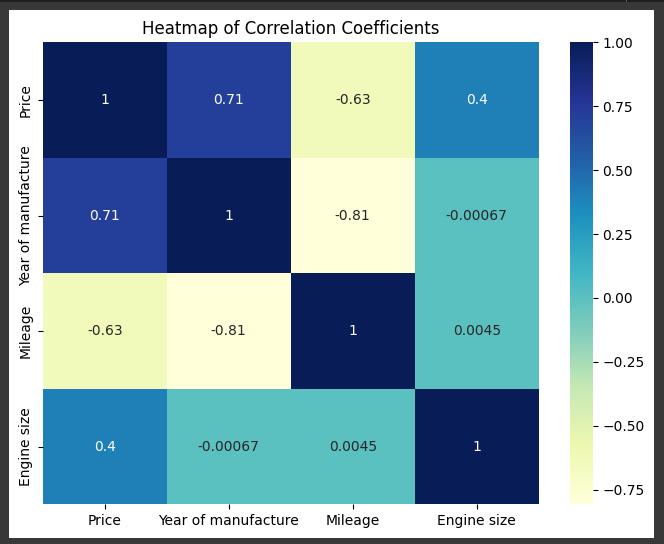

In this project, we predict the price of used cars using various machine learning techniques.
Some of the techniques applied are:

1. Linear and Polynomial Regression Models
2. Artificial Neural Network Models
3. Clustering Algorithms - K-Means Clustering and Agglomeerative Clustering

Each regression model is also evaluated using various metrics such as MAE, MSE, RMSE, and R2 Score
Metrics such as Silhouette Score and Davies Boulding Coefficient are also used to evaluate the effectiveness of the clustering analyses.

